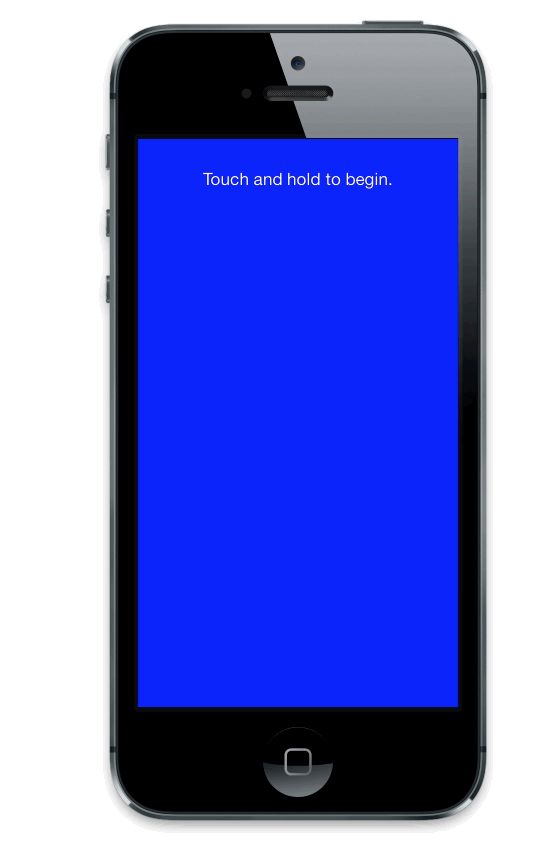

# TouchLong

The recent success of Flappy Birds begs the question:  How simple can a game be?

Instead of the drudgery of repeated taps, TouchLong only needs one. But, how
long can it be?

Touch the screen, and don't let go for as long as you can.  To make it a little
trickier, you have to avoid the big dot.

## Notes

### Code Style

* I'm trying an experiment of using direct ivar access for internal/private
  ivars, rather than properties.

